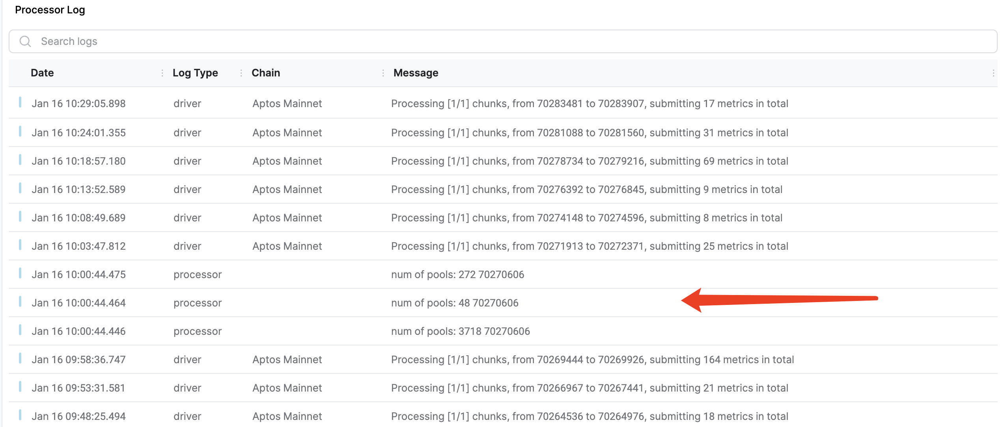

# Debug processors

You can debug processor via console logs. Simply do

```typescript
console.log("num of pools: ", pools.length, ctx.version.toString())
```

Then you could view the debug log from the UI.

<figure><figcaption><p>processor console log</p></figcaption></figure>
