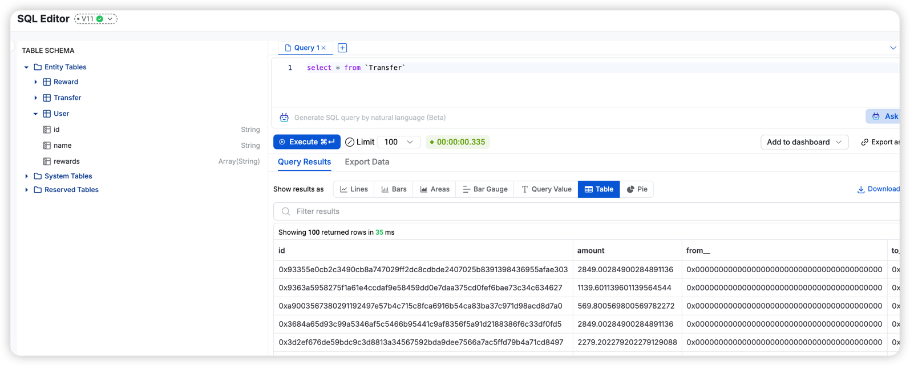
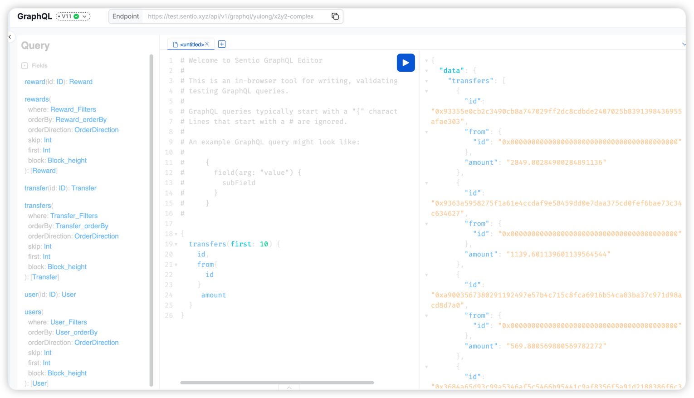

Starting from SDK version 2.38, you have the ability to structure your data according to a predefined schema. This data can be accessed during the execution of the processor. Furthermore, this data can be retrieved using our SQL and GraphQL API.

## Schema
The schema can be established utilizing the GraphQL schema definition language. This schema is specified in the store.graphql file located at the root of the processor directory. The following is an example of a schema definition:


```graphql
 type Transfer @entity {
    id: ID!
    from: User!
    to: User!
    amount: BigDecimal!
}

type User @entity {
    id: ID!
    name: String!
}

```

The structure of the schema is made up of entities, interfaces, and enums.

### Define Entities

An entity is a type that represents a data structure. The entity is defined using the `@entity` directive. The entity can have fields that are scalar types or other entities. The entity must have an `id` field of type `ID!`.

#### IDs
Every entity is required to define a field named id with the type of ID!. This id field serves as the primary key and ensures uniqueness across all entities of the same type.

#### Scalar Types
The scalar types are the basic building blocks of the schema. The scalar types includes:
- Int 
- Float
- String
- Boolean
- ID
- BigInt
- BigDecimal

#### Relationships
Entities can have relationships with other entities. The relationships can be one-to-one, one-to-many, or many-to-many.   

##### One-to-One relationship
In instances where a single entity is linked to another single entity, it's typically referred to as a one-to-one relationship.

For instance, a user is associated with a single corresponding profile, and each profile is linked to one specific user.
```graphql
type Profile @entity {
    id: ID!
    user: User!
}

type User @entity {
    id: ID!
    profile: Profile
}
```

##### One-to-Many relationship
To establish a one-to-many relationship in an entity, you should use square brackets around the field type. This indicates that the field can hold multiple instances of the related entity.

For instance, a company can have multiple employees, but each employee is associated with only one company.
```graphql
type Company @entity {
    id: ID!
    name: String!
}
type Employee @entity {
    id: ID!
    name: String!
    company: Company!
}
```

###### Reverse lookup by derivedFrom
The `@derivedFrom` directive is used to specify the field in the related entity that the relationship is derived from.

```graphql
type Company @entity {
    id: ID!
    name: String!
    employees: [Employee!] @derivedFrom(field: "company")
}
type Employee @entity {
    id: ID!
    name: String!
    company: Company!
}
```

##### Many-to-Many relationship
To define a many-to-many relationship, you should use square brackets around the field type in both entities.

For instance, a student can enroll in multiple courses, and each course can have multiple students.
```graphql
type Student @entity {
    id: ID!
    name: String!
    courses: [Course!]! @derivedFrom(field: "students")
}
type Course @entity {
    id: ID!
    name: String!
    students: [Student!]!
}
```

#### Interfaces
Interfaces are a type of structure in GraphQL that can be used by entities. They are created using the interface keyword and can contain fields of scalar types or other entities. Entities can implement these interfaces using the implements keyword. They are beneficial for defining fields that are common across multiple entities.

```graphql
type Project @entity {
    id: ID!
    name: String!
    owner: ProjectOwner!
}
interface ProjectOwner {
    id: ID!
    name: String!
}

type User implements ProjectOwner @entity {
    id: ID!
    name: String!
}

type Organization implements ProjectOwner @entity {
    id: ID!
    name: String!
}


```

#### Enums
Enums are a type of structure in GraphQL that can be used to define a set of constants. They are created using the enum keyword and can contain a list of values. Enums are useful for defining fields that have a fixed set of values.

```graphql
enum Role {
    ADMIN
    USER
}
type User @entity {
    id: ID!
    name: String!
    role: Role!
}
```

## Accessing Data in Processor
After defining the schema, you can use `sentio build` to generate the TypeScript types for the schema. The generated files is located in the `src/schema` directory. The following is an example of the generated types:

```typescript
type UserData = Omit<User, "rewards"> & {rewards?: Array<ID|Reward>}

@entity("User")
export class User extends Entity {
    constructor(data: Partial<UserData>) {
        super(data)
    }
    get id(): ID { return this.get("id") }
    set id(value: ID) { this.set("id", value) }
    get name(): String { return this.get("name") }
    set name(value: String) { this.set("name", value) }
}
```

The generated types can be used to access the data in the processor. use `ctx.store` to interact with the data store.  

### Insert or Update Data
To insert or update data in the store, you can use the `ctx.store.upsert` method. The following is an example of inserting a new user:

```typescript
import { User } from './schema/schema.js'
ERC20Processor.onEventTransfer(
    async (event, ctx) => {
        const from = new User({
            id: event.args.from
        })

        await ctx.store.upsert(from)
        const to = new User({
            id: event.args.to
        })
        await ctx.store.upsert(to)
    }
)
```

### Get entity by ID
To retrieve an entity by its ID, you can use the `ctx.store.get` method. The following is an example of retrieving a user by its ID:

```typescript
import { User } from './schema/schema.js'
ERC20Processor.onEventTransfer(
    async (event, ctx) => {
        const from = await ctx.store.get(User, event.args.from)
        const to = await ctx.store.get(User, event.args.to)
    }
)
```

### Get entity list
To retrieve a list of entities, you can use the `ctx.store.list` method. 

```typescript
import { User } from './schema/schema.js'
ERC20Processor.onEventTransfer(
    async (event, ctx) => {
        const users = await ctx.store.list(User)
    }
)
```

*Please note that currently, the list method returns all entities. In future updates, we plan to introduce pagination and filtering capabilities.*

### Delete entity
To delete an entity, you can use the `ctx.store.delete` method. The following is an example of deleting a user:

```typescript
import { User } from './schema/schema.js'

const id = event.args.from
await ctx.store.delete(User, id)

```

### Query Data using SQL
You can query the data store using SQL.  Just like you do with event logs data. The entity will show up in table schema. 

 

### Query Data using GraphQL
You can query the data store using GraphQL. The query schema will be generated based on the schema definition. 

