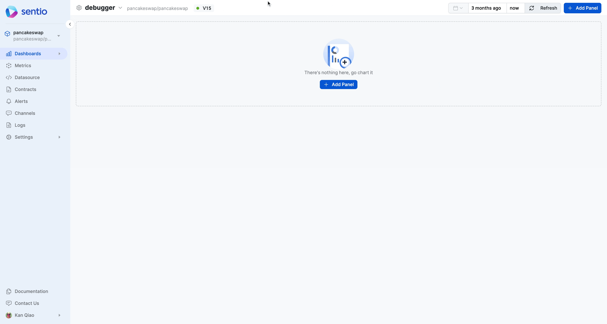

# ➡ Build Dashboards

## Build Metrics Dashboard 

To use the metrics to better do visualization and computation, you could build dashboard using the metrics collected.&#x20;

This is following the metrics submitted by [monitor-coinbase-cbeth-mint-burn-via-events.md](data-collection/working-with-different-chains/evm-chains/monitor-coinbase-cbeth-mint-burn-via-events.md "mention")

Here is one example we have a dashboard to show the **Mint Activity - 24 Hours Aggregation.**

<figure><figcaption></figcaption></figure>

Here we take a metric and apply a rollup function to perform 24 hours sum aggregation. For more about the formula and functions, refer to [aggregation-functions-and-formulas.md](../references/concepts/visualizations/aggregation-functions-and-formulas.md "mention")

## Build Event Analytics Dashboard 

Following [monitor-pancake-swap-ifo-deposit.md](data-collection/working-with-different-chains/aptos/monitor-pancake-swap-ifo-deposit.md "mention"), we could build a dashboard to show Daily Active Users.

<figure><figcaption></figcaption></figure>


This requires the event were submitted with [#distinct-id](../developer-guides/sdk-guide/logs-in-processor.md#distinct-id "mention")


For more complete features of dashboard, refer to [dashboard.md](../references/concepts/visualizations/dashboard.md "mention")

