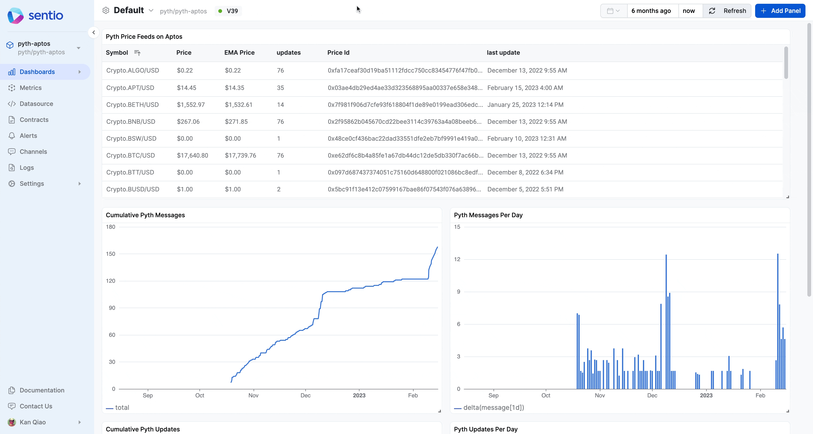
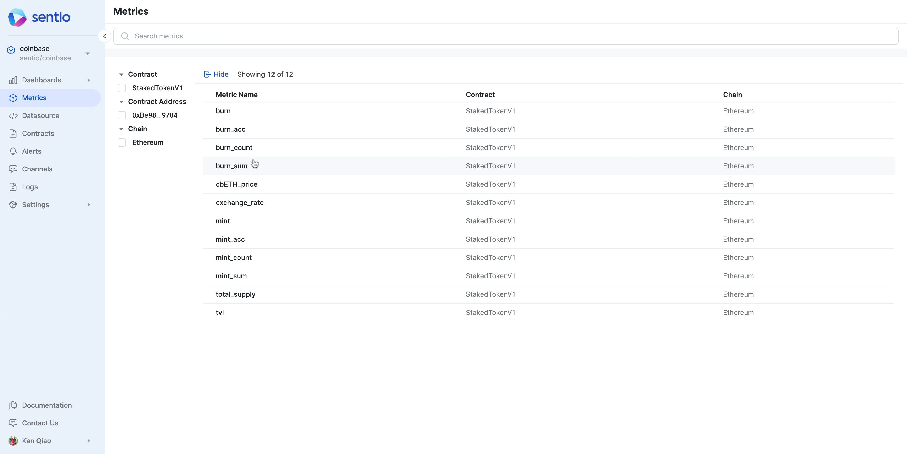
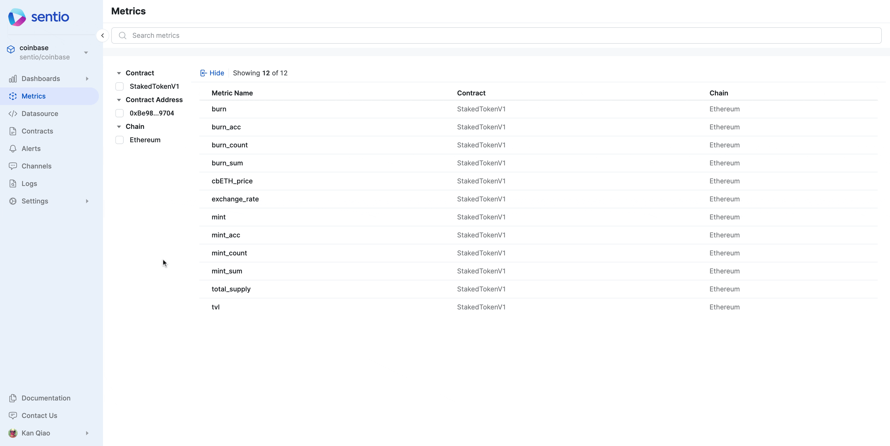

# ➡ View Metrics

## Metadata

After the processor is successfully uploaded, you can first check the status of the processor on [**Datasource**](../references/ui-layout.md) tab. Make sure the status is shown as processing. Also, take notice of the **block number** or **Version** on each chain (Yes, we support multi-chain: [multi-chain-support.md](../best-practices/multi-chain-support.md "mention")) is processed at.

<figure><figcaption>
Viewing Data Source
</figcaption></figure>

You can also examine the status of the collected [metrics](../references/ui-layout.md) on the Metrics tab.&#x20;

<figure><figcaption>
Viewing Metrics
</figcaption></figure>

Clicking on each [metric](../references/concepts/data-types/metrics.md) gives you a more detailed view of the metric, including tags and visualization of the metrics.

## Single metric on UI

For the metric generated by [monitor-coinbase-cbeth-mint-burn-via-events.md](data-collection/working-with-different-chains/evm-chains/monitor-coinbase-cbeth-mint-burn-via-events.md "mention"), the corresponding metric `mint_acc` is:

&#x20;

<figure><figcaption>
Viewing a single metric mint_acc
</figcaption></figure>

For the metric generated by [monitor-totalsupply-of-cbeth-via-interval.md](data-collection/working-with-different-chains/evm-chains/monitor-totalsupply-of-cbeth-via-interval.md "mention"), the corresponding metric `total_supply` is:

<figure><figcaption></figcaption></figure>

Now we have raw metrics, Let's go to [build-dashboards.md](build-dashboards.md "mention")
