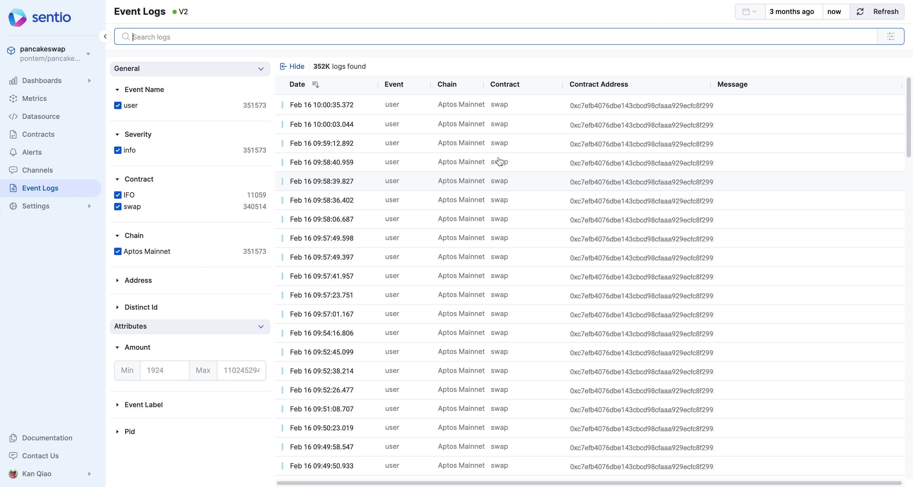
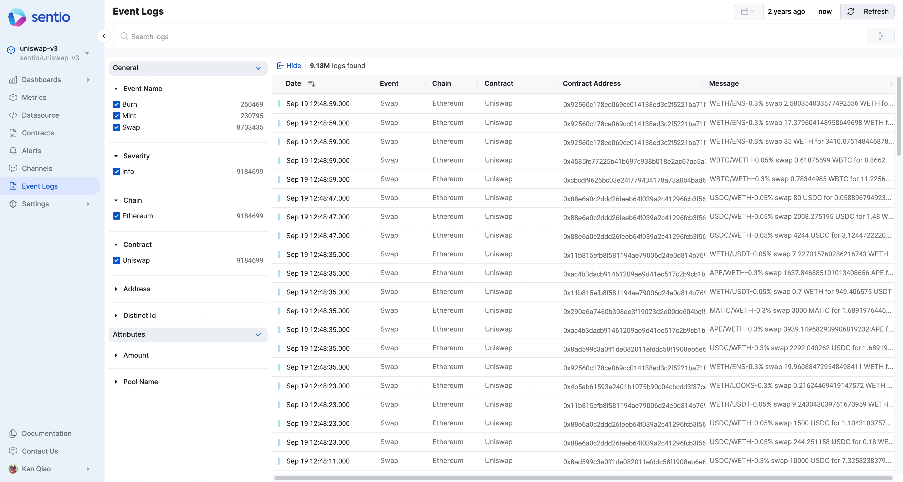

# ➡ View And Search Event Logs

The logs are available from Sentio UI. It contains all the Deposit Event we submitted from [submitting-event-logs.md](../data-collection/submitting-event-logs.md "mention")

If you'd like to do a range search on Amount between **1000 and 10000** submitted from [#submit-attributes](../data-collection/submitting-event-logs.md#submit-attributes "mention") , you could easily do this from the UI:

<figure><figcaption></figcaption></figure>

If you'd like to search for all the swaps from USDC, you can do full text search:

<figure><figcaption></figcaption></figure>

For more details regarding submitting logs in processor, refer to [event-logs-in-processors.md](../../developer-guides/sdk-guide/event-logs-in-processors.md "mention")

For more details regarding the definition of logs, refer to [event-logs.md](../../references/concepts/data-types/event-logs.md "mention")
