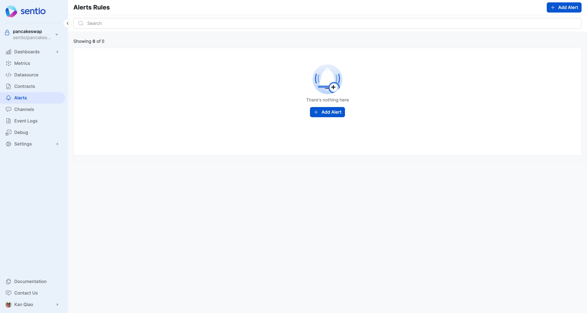
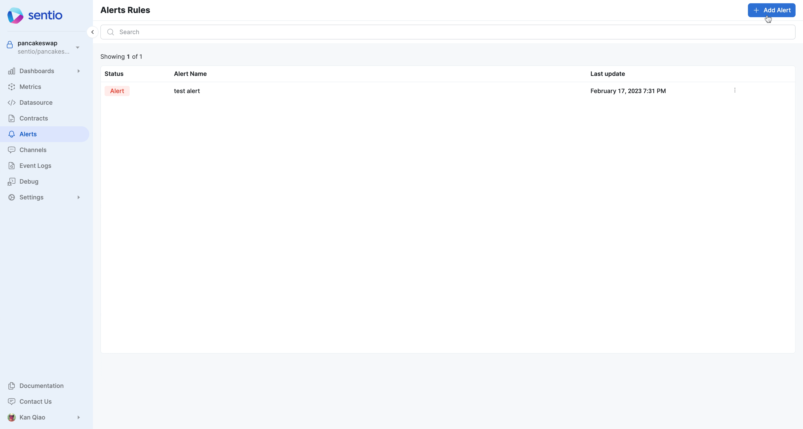

# ⏰ Alerts

Alerts can be created for a query or formula to notify (via [notification-channel.md](notification-channel.md "mention")) when a certain condition is met.&#x20;

## Metrics based alert (same as [create-alerts.md](../../how-to-guides-by-examples/create-alerts.md "mention"))

Assume we want to alert if TVL of your project is below a threshold, you could&#x20;

* Select the metric that represents the TVL
* Add a alert condition
* Choose a notification channel [notification-channel.md](notification-channel.md "mention")

<figure><figcaption></figcaption></figure>


Note you can also use [formula](visualizations/aggregation-functions-and-formulas.md) in alerts


## Log based Alerts

You can count certain number of logs matching a criteria, and setup alerts based on the condition.

<figure><figcaption></figcaption></figure>

###
