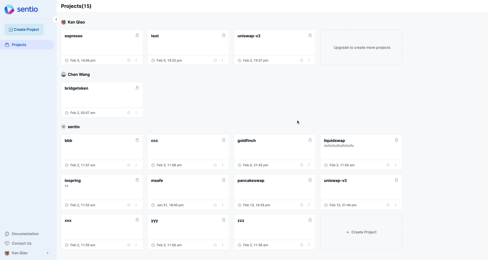

Click the profile page on the **left bottom corner** and then create an [API key](https://app.sentio.xyz/profile/apikeys).

<figure><figcaption><p>Obtain API Key</p></figcaption></figure>

API key could be used for API call and login with command line. To login, copy the command given and execute in any terminal. Then you are all set.


Note, Please replace with your own API key.


```bash
export YOUR_API_KEY=generated from UI
npx -y -p @sentio/cli sentio login --api-key $YOUR_API_KEY
```
