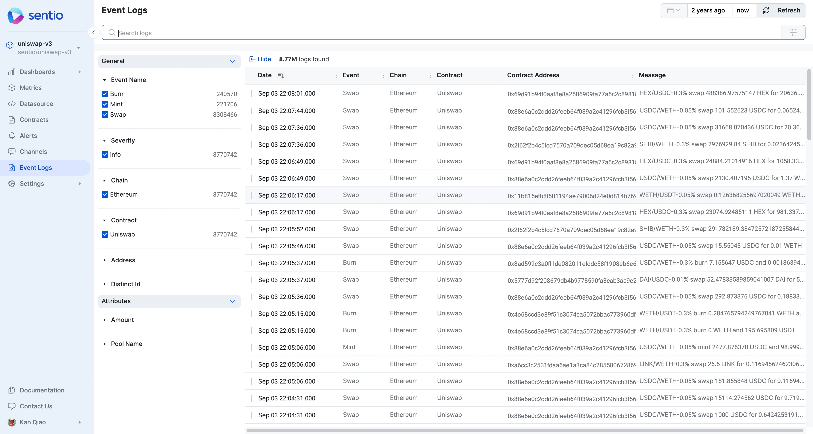
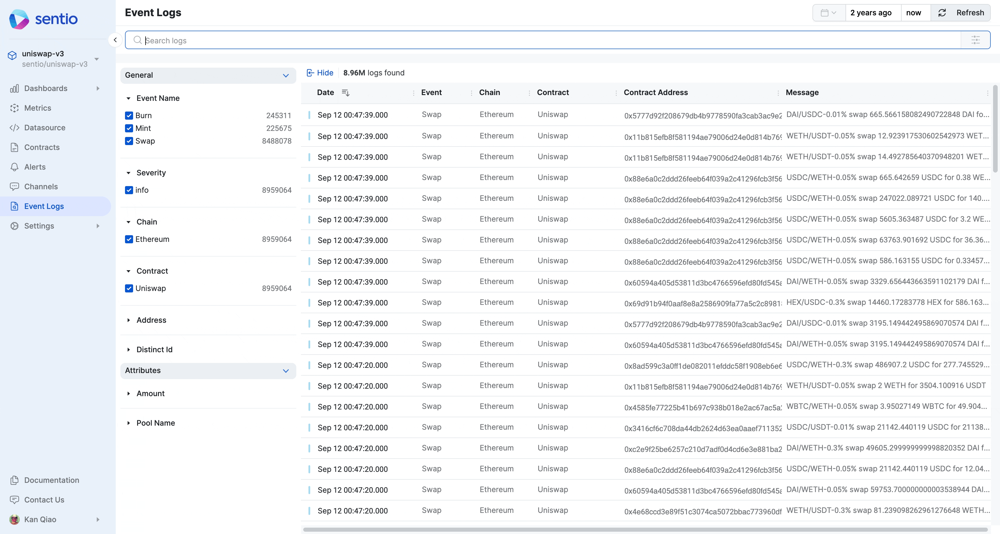
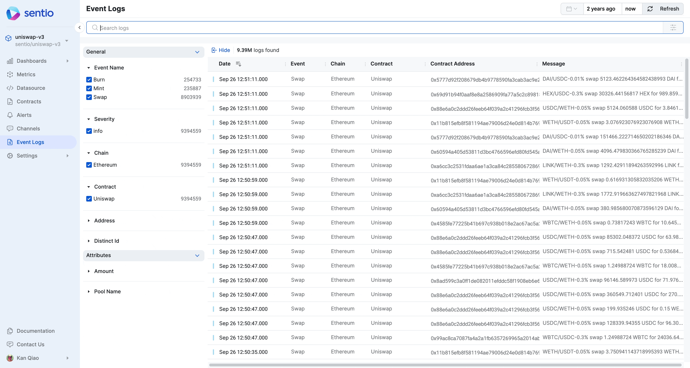
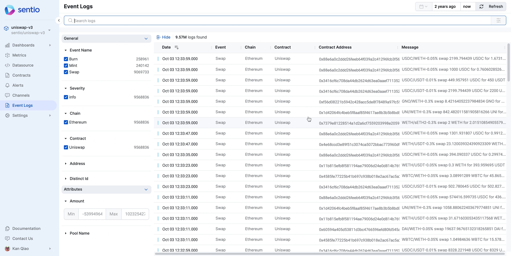
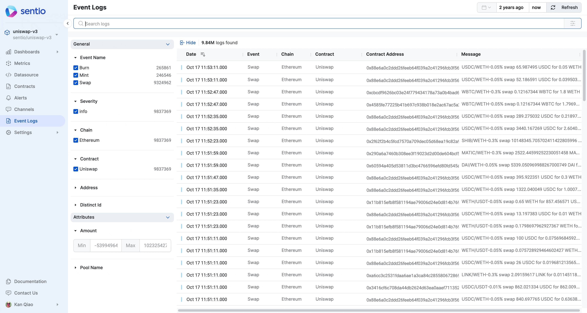

# 📕 Event Logs

Every event log is a structured data stored in Sentio. Users can submit it from Sentio Processor as decribed in [logs-in-processor.md](../../../developer-guides/sdk-guide/logs-in-processor.md "mention")

## Log Levels

Sentio allows users to submit and search for logs. Logs naturally have 5 levels:

* DEBUG
* INFO
* WARNING
* ERROR
* CRITICAL

## System Labels

Sentio also attach system labels automatically to the log, including:

* Contract
* Address
* Chain

## Event Analytics

Follow [event-analytics-dashboard.md](../visualizations/event-analytics-dashboard.md "mention")to learn how to visualize Events.

## Filter Event Logs on UI

Using the menu on the left hand side, users can filter the log based on [#log-levels](event-logs.md#log-levels "mention")and [#system-labels](event-logs.md#system-labels "mention"). The Labels selection is standard faceted search filters.

* Click a label switch between **All** and **Only**

<figure><figcaption></figcaption></figure>

* Click the checkbox **exclude** a label

<figure><figcaption></figcaption></figure>

## Full Text Search

We support **full-text search** on logs. If you want to search all the **SWAP USDC:**

<figure><figcaption></figcaption></figure>

## Search with conditions

### Term

Let's find all the logs with a given poolName

<figure><figcaption></figcaption></figure>

### Range

Let's find all the logs with **amount** between 1000 to 10000.

<figure><figcaption></figcaption></figure>

### Composite conditions

The conditions are composable

<figure><figcaption></figcaption></figure>

