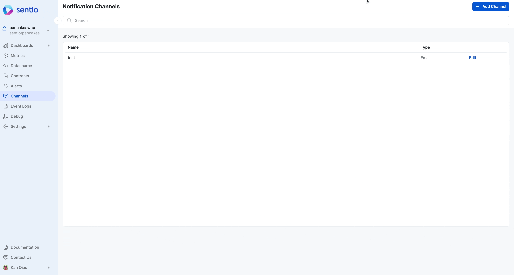
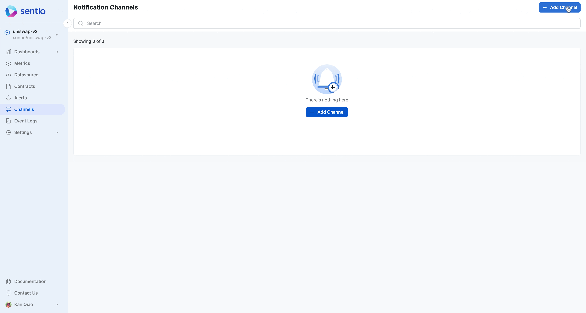

# 🥫 Notification Channel

We support creating notification channel for

* Email
* Webhook
* Slack
* Telegram

## Creating Email Channel

<figure><figcaption>
Creating Email Channel
</figcaption></figure>

## Creating Slack Channel

You could follow UI instructions to perform slack integration.

## Creating Webhook Channel

<figure><figcaption></figcaption></figure>

Note, you can perform authentication through adding a custom header. In this example, we use a **key** with value **mockkey.**

