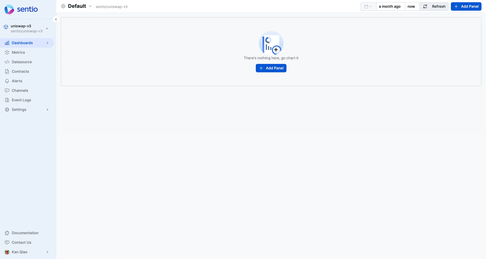

# ⚡ Event Analytics Dashboard

Event Analytics Dashboard is used to visualize data submitted by [logs-in-processor.md](../../../developer-guides/sdk-guide/logs-in-processor.md "mention")

Here is one example we make a dashboard for **Accumulative Unique Users**

<figure><figcaption></figcaption></figure>


This requires the event were submitted with [#distinct-id](../../../developer-guides/sdk-guide/logs-in-processor.md#distinct-id "mention")


## All Events

_All Events_ is a union of all the events submitted. It is a handy way for us to compute the **Accumulative Unique Users** of all your data.
