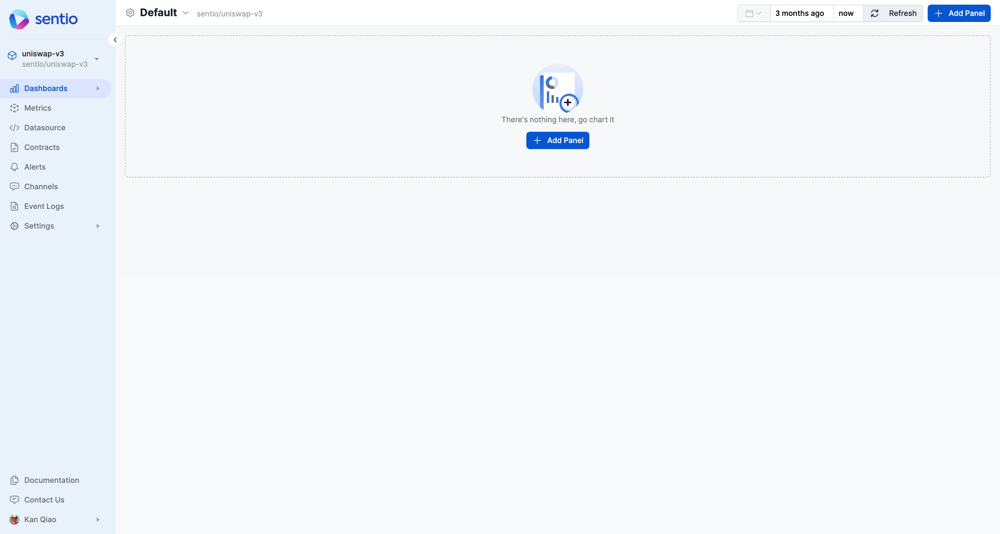

# 🔺 Metrics Dashboard

Metrics dashboard for [#counter](../data-types/metrics.md#counter "mention")and [#gauge](../data-types/metrics.md#gauge "mention")only.

For the list you could view all the available metrics you submitted from the processor. You could then apply [aggregation-functions-and-formulas.md](aggregation-functions-and-formulas.md "mention")on top of the metrics

Here is one example to make a dashboard to show the daily trading volume from a metric `vol_sum` collected.

<figure><figcaption></figcaption></figure>

* Initially, it is multiple series for multiple pairs.
* Adding aggregation makes it only one series.
